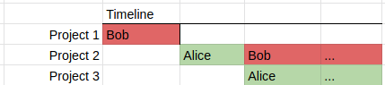

10 Hard Decisions: A Model for Programmer Productivity
======================================================

**09/26/20**

How do you ensure that programmers are using time effectively?
What can you do to help them be productive?
Managers think a lot about these questions.
But too often they get the answers wrong despite being very earnest and smart.
This is because they have an unexamined mental model of how programming work is actually done.
With an inaccurate model, managers optimize the wrong things and make bad decisions
which would otherwise be good decisions in other work environments.

To understand the idea, let's look at a few examples of how productivity varies between jobs.
Simple manual labor, like digging holes, is easy to understand.
Productivity comes down to moving as much dirt per minutes as possible.
Progress is very measurable, and it easy to think about how to improve it.
As a manager, you might ensure there is a rotation of workers digging at all time,
and that everyone has the best tools possible.
However that looks very different than the working model for a professional baseball scout.
A scout can take a few years of evaluating players just to find one great pro.
There aren't simple metrics you can use to measure their progress.
It's hard to tell exactly what productive work should look like.
Exposure to a lot of players can help, but ultimately it comes down to a few big choices.

What kind of work is programming most like?
In my experience (especially in agencies), the typical
model of a programmer is an expensive factory machine.
This is the kind of machine that occupies a lot of space and attention in the factory.
It's operation is fragile, so it needs to be constantly checked on and maintained.
But most importantly, every minute that it is not working on jobs is expensive money wasted.
The primary metric for ensuring it stays productive is utilization time, even if that means spending time
on throw away jobs.

Managers understand this work model very well, perhaps they read "The Goal" in school.
They look for metrics to identify throughput and bottlenecks and do lots of shuffling of programmers
around to ensure maximum utilization.
In it's most exaggerated form this led managers to obsess over metrics "lines of code per week".
Although we have moved beyond that.
The underlying thinking about what's going on has changed much.
We just think about programmers as feature producers.
The task the programmer needs to finish programmer needs to sit at the computer and type in the project.

Here is a common example of this thinking: Bob is busy finishing task 1 and then will start project 2.
Alice has a bit of downtime before she starts project 3.
Let's have Alice get started on project 2, then we can
have her hand off the incomplete work to Bob.
In a few weeks when he is ready, Alice can move on to project 3 and leave Bob with a head start.

This seems like smart move.
We made sure that Alice and Bob's valuable time was well used, right?

## A better Model

To see why this decision may actually waste time, we need
a better understand what programming is like.
The model I will describe is not perfect, it's a great simplification, but
its a rough estimation that's far more accurate than the factory machine one.
That better model is the following:
**each project consists of making 5-15 difficult software decisions**.
All of these decisions are of course somewhat dependent on one another.
Each of those decisions that is made well, will lead to shipping the project,
Each decision made wrong, will cause delays and waste time, now or down the road.
That's all. That's the description of the job programmers need to do,
and how they occupy their time.
If programmers knew what to write beforehand, they could type it in no time!
The time they spend fiddling at the keyboard is actually gather information
through experiment and observation, in order to make decisions.

As a manager, the way to improve productivity
is to simply think about what would help you make hard decisions.
Here are some simple ideas that become immediately obvious, given this clearer model:

- Give programmers as much possible information about the project as early as possible.
  It's difficult to make decisions with incomplete information.
  When you get ideas early they can sit in the back of your mind and get some sleep
  time.  Organize information so its easy to process.
  
- Protect programmer time from interruptions. 
  Design large blocks of uninterrupted time.
  Have quiet working environments.
  It's hard to make good decisions without focus.
  Other writers have written extensively about the cost of "[context switching][1]"
  when you have to forget about what you were thinking and start thinking about something new.
  
- Ensure programmers have a clear understanding of project priorities and goals.
  Clearly communicate expectations and requirements.
  Making good decisions requires making trade-offs.
  Unclear priorities will lead to programmers making bad decisions.
  Changing priorities will invalidate previously good decisions.
  
- It's OK if a programmer is not at their keyboard writing code. 
  Taking a walk or a rest is often productive time.
  Distracting activities like watching a lot YouTube are not.

- Don't treat programmers interchangeably.
  Give them ownership of specific project pieces so they can make long term decisions and build on previous ones.
  Would you hire a separate architect to design each room of a house?

- Ensure your incentive structure rewards good decision making.
  Do you reward band-aid approaches? Are programmers just trying to get it "over the fence"
  so someone else has to deal with it? Are programmers are the receiving side of the fence?

- Going through a crunch? [Don't add people][2] to a late project. Throw more money and effort at building an focused environment to making decisions. Can you pay someone to errands at home so the programmer doesn't have to think about them? Can you bring their family to the office for a lunch? (1)

This is just a short list of suggestions and you can probably can come up with even better
ideas.
What's important is that as we think deeper about this model common productivity mistakes become apparent. (2)

Let's analyze the Bob and Alice example again using this model.
Did we help Alice and Bob make decisions or hurt them?
Recall, Alice starts working on task 2 for a few weeks, to get it started for Bob.
Then Bob picks it up, and Alice moves elsewhere.
In our rough model we can assume that when Alice finishes, she has made 2 of the 15 decisions, and has some vague ideas about 5 others.
The manager arranges a meeting for Alice to inform Bob of her work and she is swept off to task 3. 
Now Bob has to start thinking about task 2 from scratch, but not only that,
he has to figure out what Alice was up to, whether the decisions she made were right,
and what direction she was heading to address the other 13 decisions.
This added information causes Bob to take more time than if he had started on his own.
In practice, its even worse because Alice and Bob will need to continue to take time from each other to coordinate about what Alice had in mind. (3)

## Smarter Alternatives

You might say, "that makes sense, but what am I supposed to do? Let Alice sit around for a week, wasting that time with an urgent project?". Let's use the model to work through better options.
In this scenario Alice is scheduled to eventually own project 3.
A better option would be to just let task 2 sit until Bob is ready, and get her stated on her project, even though it may be less urgent. 
Alice will be able to spend more time thinking about her project, and leave Bob with a fresh slate.

"But this is really urgent, I don't even want to think about project 3 yet".
The next alternative would be to identify decisions which Alice can make which have the least impact on the other work Bob needs to do.
One would be having Alice better define the requirements and organize resources for this project.
This will only help Bob make his decisions.
Another idea is to have Alice work on "black boxes" that Bob doesn't need to know how they work.
Maybe Alice has some special knowledge and can write a hard function he expects to use.
What you absolutely don't want to do is interrupt Bob and have him start thinking about what decisions Alice could be making, while he is making his decisions.
That doesn't make any sense!

[1]: http://www.paulgraham.com/makersschedule.html
[2]: https://en.wikipedia.org/wiki/Brooks%27s_law

## Notes

1. I don't think programmers *deserve* any of these special treatments over other jobs.
I am not suggesting that programmers should have special privileges or are somehow more important than other kinds of work.
It's all about the productivity model for the kind of work they do.

2. In video game production, art tends to be easy to outsource while programming is notoriously difficult and often unsuccessful. Perhaps this is because 3D art production can be better fit into a factory production productivity model.

3. One reason "just write it from scratch" is so appealing for programmers is that
they get to make their own decisions, instead of figuring out why others made (often bad) decisions.
Who wants to live with someone elses choices?
For large existing codebases this represents a lot of invested knowledge, so its usually bad,
but for a new task, Why would you rob a programmer of this opportunity by playing
musical chairs?

