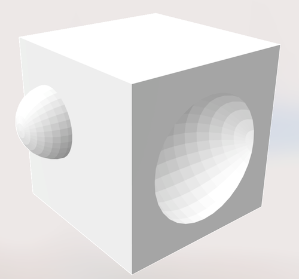
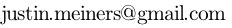

Justin Meiners
==============

Welcome to my personal website!
I love learning and creating new projects.
I hope to share some of them with you.
Feel free to contact me at: 

## Background

Here is a little about my background and interests:

- I first learned to program in 2008 using [Objective-C](https://developer.apple.com/library/archive/documentation/Cocoa/Conceptual/ObjectiveC/Introduction/introObjectiveC.html) and Cocoa/NextStep thanks to the [CMSEC](https://en.wikipedia.org/wiki/Christa_McAuliffe_Space_Education_Center).
- I am a Software Engineer in the Vision Products Group at [Apple](https://www.apple.com/) (I do not write about my employer's products or business).
- My best effort at a professional title is "computer vision generalist". My skills include 3D rendering, GPUs, numerical methods, optimization, combinatorics, signal processing, etc.
- I have a Master's degree in math and view it as a lifelong pursuit. I have broad knowledge at the "advanced undergrad" level with more depth in real analysis and topology.

    

- I like 3D modeling and texturing, but I am not much of a visual artist. I learned by tinkering with [anim8or](https://www.anim8or.com). Now I use Blender. However, I am not a very good artist.
- I enjoy reading philosophy, especially Plato and Aristotle.

## Projects

This is work I have dedicated some significant effort into creating and releasing.

- [09/12/2022 - Volcano Drop (js13kgames entry)](https://js13kgames.com/entries/volcano-drop)
- [04/21/2022 - Why Train When You Can Optimize?](https://www.jmeiners.com/why-train-when-you-can-optimize/)
- [03/07/2022 - srcweave: A literate programming system for any language](https://github.com/justinmeiners/srcweave/)
- [09/19/2021 - Classic Colors](https://github.com/justinmeiners/classic-colors)
- [07/31/2021 - Efficient Programming with Components](https://www.jmeiners.com/efficient-programming-with-components/)
- [04/06/2021 - Master's Thesis: Computing the Rank of Braids](https://github.com/justinmeiners/braid-rank-thesis)
- [07/28/2019 - Write Your Own Proof-of-Work Blockchain](https://www.jmeiners.com/tiny-blockchain/)
- [01/13/2019 - McCulloch & Pitts Neural Net Simulator](https://www.jmeiners.com/neural-nets-sim/)
- [01/05/2019 - An Adventure in Pre-Rendered Backgrounds](https://www.jmeiners.com/pre-rendered-backgrounds/)
- [12/16/2018 - Write your Own Virtual Machine](https://www.jmeiners.com/lc3-vm/)
- [04/19/2018 - Lisp Interpreter](https://github.com/justinmeiners/lisp-interpreter)
- [01/27/2018 - Spherical Harmonics](https://github.com/justinmeiners/spherical-harmonics)
- [06/01/2017 - Shamans: A 3D Turn-based Strategy Game](https://www.jmeiners.com/shamans/)
- [08/20/2013 - C Craft](https://github.com/justinmeiners/c-craft)
- [07/02/2013 - Image Sequence Streaming](https://github.com/justinmeiners/image-sequence-streaming)
- [01/08/2013 - iOS Color Wheel](https://github.com/justinmeiners/ios-color-wheel)

You can also find smaller projects and experiments at my [GitHub page](https://github.com/justinmeiners).

## Notes

I hope to share insights, experiences, and occasionally answer some questions. This writing is informal and sometimes unpolished.

- [04/05/2025 - Combat Robot](combat-robot/)
- [05/12/2024 - Building Scanning Patents](floorplan-scanning/)
- [11/18/2022 - Thinking styles from math](thinking-styles/)
- [10/27/2022 - Iterating grid cell neighbors](grid-neighbors/)
- [07/21/2022 - The Quake entity system: shell scripting for games](quake-entities/)
- [06/25/2022 - A simple mesh adjacency data structure](mesh-adjacency-trick/)
- [03/07/2022 - Literate programming is much more than commenting code](literate-programming/)
- [03/05/2022 - Deploying Common Lisp Scripts](common-lisp-scripts/)
- [07/28/2021 - Almost Solving the Halting Problem](almost-solving-the-halting-problem/)
- [06/14/2021 - Swift Proposal: Balanced Binary Reduction](swift-balanced-reduce/)
- [05/03/2021 - Three Myths About Passive Investing](three-myths-passive-investing/)
- [12/27/2020 - Advent of Code 2020 Day 18: Rethinking Operator Precedence](aoc-2020-18/)
- [12/19/2020 - Advent of Code 2020 Day 19: An Easy way to do Part 2](aoc-2020-19/)
- [11/15/2020 - The Universal Property of Quotients](universal-property-quotients/)
- [10/08/2020 - Questioning Probablity](questioning-probability/)
- [09/26/2020 - Understanding LINQ GroupBy](understanding-groupby/)
- [09/12/2020 - Gesture Recognition with Line Integrals](https://www.jmeiners.com/gesture-recognition/)
- [05/24/2020 - Boring Benefits of Lisp](boring-benefits-of-lisp/)
- [04/12/2020 - 10 Hard Decisions: A Model for Programmer Productivity](10-hard-decisions/)
- [01/23/2020 - Keeping Up-to-Date](keeping-up-to-date/)
- [01/21/2020 - MultiplyPoint3x4 in Unity](unity-fast-multiply/)
- [06/08/2019 - Think in Math. Write in Code.](think-in-math/)
- [04/14/2019 - Foundations of Math Reading List](foundations-of-math-reading/)
- [05/12/2019 - Notes On Vector Libraries](vector-libs/)
- [02/22/2019 - The Skills Poor Programmers Lack](the-skills-programmers-lack/)
- [05/01/2017 - Modern OpenGL](modern-opengl/)
- [11/10/2016 - HoloLens Impressions](hololens-impressions/)
- [10/30/2016 - 3D Paint](3d-paint/)
- [10/15/2015 - Old Artwork](old-artwork/)
- [10/09/2015 - Old Games](old-games/)

## Archives

Sites I preserve for learning and historical purposes.

- [Calculus on Manifolds Course Site (By: K.K. Kubota)](https://www.jmeiners.com/calculus-on-manifolds-site/)
- [Common Lisp Hyperspec (LispWorks)](https://www.jmeiners.com/clhs/HyperSpec/Front/)
- [Google Chrome comic book](https://www.jmeiners.com/google-chrome-comic-book/chrome.html)
- [Radiosity (By: Hugo Elias)](https://www.jmeiners.com/Hugo-Elias-Radiosity)
- [SGI STL Documentation](https://www.jmeiners.com/sgi-stl-docs/)
- [SGI STL Source](https://github.com/justinmeiners/sgi-stl)
- [Structure and Interpretation of Computer Programs (original HTML)](https://www.jmeiners.com/sicp-html-original/book.html)
- [Structure and Interpretation of Classical Mechanics (2nd edition, HTML)](https://www.jmeiners.com/sicm-2-html/book.html)
