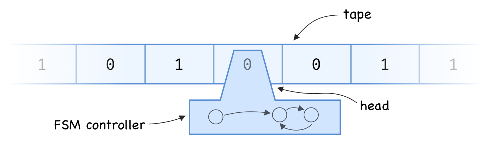

Almost Solving the Halting Problem
==================================

By: [Justin Meiners](https://github.com/justinmeiners)

The halting problem is to devise a method that can determine whether a given
Turing machine terminates, in a finite amount of time. It is well-known to be
undecidable; no such method exists.
Naturally, if you ever write a proof that implies how to solve it, there is reason for concern. 

In writing my master's thesis, I unfortunatly did just that.
It took quite a bit of reading and discussion to detect what went wrong.
It turns out, I didn't make any major mistakes.
Instead, I learned that the difference
between computability and incomputability is quite subtle.
I wanted to share this insight to give others a better
sense of what it means for a function to be incomputable.

My thesis focused on braid group algebra, and reasoning about
how a particular property of braids can be computed.
Since this is a specialized topic and the details aren't important,
I will explain a similar problem using Turing Machines directly.

## Turing machine

A Turing machine consists of:

- An infinitely long tape, divided into cells.
  Each cell has a symbol written on it.
  This symbol comes from a finite alphabet `S` (often `{ 0, 1 }` where `0` is "blank").
- A read/write head positioned over a particular cell on the tape.
- A controller that moves the tape and reads and writes symbols.
  The controller is a finite state machine `Q`.

The read/write head reads a symbol, and passes that as a input to the controller.
The controller can then replace the symbol, transition to a new state, and shift the tape by a finite amount.
Which symbol to write and where to transition to is entirely determined by the controllers
state and the symbol read.

For answering questions about computability and complexity it doesn't matter how many symbols 
the alphabet has, or how complex the finite state machine is.

## Estimaing the number of operations 

How do we go about determining whether a Turing machine will halt?
Here is the basic idea: run the machine for a large number of steps.
If it runs a longer than our allotted budget, it probably won't terminate!

Ok, that's  obvious and not very helpful. "probably won't" isn't good enough.
The whole difficulty is that the machine might run longer than we expect and still terminate.
But, what if we could actually determine what that threshold is?
In other words, what if there was a number of steps that any terminating machine will not exceed?
It might seem likethere is no way to determine such a bound, but it actually is pretty straightforward.

We can estimate how long a Turing machine will run, based on it's "complexity".
In computer science we often think longer programs are more complex.
Similarly a Turing machine with a lot of information on the tape has a "long program"
to run and work with.

A Turing machine has only finitely many non-blank squares.
For a fixed state machine `Q` and alphabet `S`, define `A(n, Q, S)` to be the set of Turing
machines in `Q` and `S` that halt and have exactly `n` non-blank squares (here `n` can be thought of as an estimate on program length).
There are at most `|S|^n` machines of this kind.
So `A(n, Q, S)` is a finite set. 
If we then let `l(t)` be the number of steps `t` runs,
`{ l(t) : t in A(n, Q, S) }` is finite and thus has a maximum `M`.

So given any Turing machine with this particular controller and configuration,
we can run it for `M` steps, and if it goes longer, then we *know* it will never terminate!
We can even define a function `f_{S, Q}(n)` which is the approximate `M` value for our inputs!
In fact, we don't care about `f` in particular,
ANY function which is stricly larger than `f` will do.

## Incomputability

So why can't we do this?
Well to know when to stop running, we would actually have to be able to compute the bound `f` in the real world.
In other words, we need an *effective procedure* or algorithm for computing `f`.
Since there is no way to solve the halting problem,
the only conclusion is that `f` grows faster than any function that can be computed in the real world.
Even though we can write programs to compute polynomials, exponentials, none of them grow fast enough.
Perhaps you could compute a lookup table to store this bound, but that would also require infinite space.

This shows us that uncomputability is primarily a problem of growth rates, not any kind
of tricky function definition.
Some functions just grow too quickly to be computed by a machine.

Note that the same limitation occurs for less sophisticated models of computation.
The [Ackermann function](https://en.wikipedia.org/wiki/Ackermann_function) is a classic
example of a function which requires the full power of a Turing machine to compute.
This is due to its fast rate of growth. 

## References

Minsky. Computation: Finite and Infinite Machines. Chapter 8.
