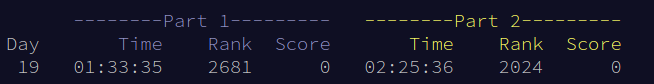

Advent of Code 2020 Day 19: An Easy way to do Part 2
==========================================================

**12/19/20**

A fun mechanic in [AOC][1] is that the problem is divided
into two parts, with the second only revealed after completion of
the first.
This challenges you to adapt an initial solution to new requirements,
encouraging flexibility of design.
In the case of [problem 19][2], a seemingly minor change, completely transforms
the requirements. 
It may seem you have to rethink everything from scratch,
but there is actually a tiny change to part 1 which solves the problem

My personal ranking wasn't great, but you can see I still
managed to catch up a bit on part 2 (even taking an additional hour!) as others got stuck.

**SPOILERS AHEAD**

## Part 1

Let's outline a standard solution to part 1.
We will stick to psuedocode, but at then end I will show some of my Common Lisp snippets.

**Parsing**

We need to parse the rules and turn them into a structure we can work with
I chose to transform them into an expression tree.
A rule such as:

    3 4 | "a" "b"

Becomes

    (or (3 4) ("a" "b"))

All the rules are stored in an array,
with their index corresponding to rule number.

Lisp makes it easy to parse.
I first replace the `|` with `^` because pie has special
semantics for the lisp reader. 
Whenever a rule contains a `^` I split it's components
into a left side and right side and wrap them in an "or".

**Evaluation**

Now we need a recursive evaluation function to handle the rule.
As an input, it takes a rule and a string.
It returns `FAIL if it cannot match,
or the modified string location if it did match.
For example when the rule "a" is applied to the following string:

    "abc"

It returns "bc" indicating successful matching.

The evaluation recursively handles the following cases:

- evaluate a char: check that the first character agrees
- evaluate a number: lookup the rule at that index and evaluate it.
- evaluate an or form `(OR r1 r2)`: evaluate both options. If one succeeded, return that. Otherwise fail.
- evaluate a list `(r1, ... ,rn)`: evaluate each rule in the list in order. Stop early if there is a fail.
                   If the string ends before the list ends, the match failed.

Success is indicated by returning an empty string.
This means we used everything up and it matched.
Test how many entries pass and you're done.

## Part 2

**What is going on?**

Part 2 makes two substitutions to the rules list.

    8: 42        ->    8: 42 | 42 8
    11: 42 31    ->    11: 42 31 | 42 11 31

It's not immediately clear why this breaks our recursive evaluation.
In fact, if you run it, it will not crash and still give you an (incorrect) answer.
So what is going on? (This question took most of my time!)

Consider the following rule:

    "a" | "a" "b"

The string "ab" now matches *BOTH* possible choices. How do we know which one to pick?
Logically, a disjunction (or) operation shouldn't care.
But whatever choice
is made will actually have an effect on whether the remaining rules in the pattern
match.

Here is an example of what can go wrong.
Suppose our string is "abc".

    0: 1 2
    1: "a" | "a" "b"
    2: "c"

Starting with rule 0, we try rule 1.
`"abc"` matches both `"a"` and `"a" "b"`.
So let's pick the first rule.
Now onto rule "c" which does not match "b c".
The match fails.

If we had chosen "a" "b" then we move
to rule 2 "c" matches the remainder "c".
We have a successful match.

**The Hard Solution**

Every time we an encounter an `OR` and both cases
match, we no longer know which one to pick.
The global success of a match can no longer be determined locally.

We aren't going to get false positives, but we may get false negatives
if we choose the wrong path to take.

A proper solution must diverge at every or, creating branching possible evaluations.
This can certainly be implemented, but is going to look very different than part 1,
and be more complicated.

**An Easy Solution**

What we really want to know is whether there is *SOME* set of choices for each OR that will cause the pattern to match.
Since we don't know what they are, we can just try a whole bunch, and see if we can find a set that does.
The easiest way to do this is by introducing probability.
Randomly pick a branch at each or.
We can then run the matcher a bunch of times and see if it finds a set of choices that match.

Let's work through the details.
We want to replace the code for "evaluate an or form `(OR R1 R2)`".
The original descrpition was:

- If one succeeded, return that. Otherwise fail.

Let's change it to a randomized choice when we don't have a better option:

- evaluate both options. If either one failed, return the other.
    Otherwise both succeeded, so randomly pick which one to return.

Now for each string run the pattern matcher a few hundred times.
Each time it will (hopefully) try different choices for each OR.
With enough tries, it should get lucky and find the best path
if there is one.

Remember, changing branch directions never introduces false positives, only false negatives.
So if it matches even one time, then we know it works.
Experiment with different numbers of times until you get a match rate that stabilizes.
If you don't run it enough times, then you will get changing answers each time you run it.
It works!

Want to learn more? Checkout [chapter 4.3][3] of SICP
on non-deterministic computing.

[1]: https://adventofcode.com/2020
[2]: https://adventofcode.com/2020/day/19
[3]: https://mitpress.mit.edu/sites/default/files/sicp/full-text/book/book-Z-H-28.html#%_sec_4.3
