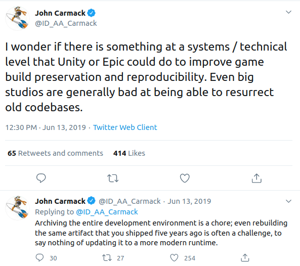

# You're Still Dependent with Docker

"Dependencies" are named as such because they make you dependent, in other words
relient, on another party.
If that party fails to act properly, your project breaks (or at least your build.)
Good engineers recognize this, and carefully consider the technical qualities of their dependencies
. Is this robust and secure code? Does it support platforms XYZ? Is it actively developed?
But what is often overlooking is that software dependency is also a social 
relationship. At then end of the day you are trusting people to be there for you.
Consider what could happen if any of the following events occured to a  project you rely on:
- no longer paying for servers
- being unavailable due to a health or family emergency
- change in business priorities or budget.
- being locked out of a Github account
- not following version conventions
- SSL/domain expiration
- server down for maintainence
- moving on to new interests
- rewriting the project

Over a long enough period, these kinds of events become inevitable, so that the internet is constantly changing.
The state of the interent is often compared to a glacier, slowly melting and transforming overtime.
In a single day, most things stay the same, to the point of being immeasurably different, but overtime little changes result in data being permanantly lost or displaced.
Modern open source software is of course living in this glacier.
Left alone, software projects melt away and can no longer be built from source.

[][1]

## Archiving Software

For actively developed software projects this is probably far down on the list of concerns,
because we can trust major organizations to support us for a long time,
and code can be updated to keep up with changes, even major ones.
But for old code sitting around this is a big problem, and it's only going to get worse as projects use more and more dependencies.

Many commenters online assume that Docker solves this archival problem.
Docker certainly leads you to think this is the case.
It feels great to get all those dependencies wrangled, down to the exact OS version, in a nicely wrapped package which anyone can move to another system.
But does this mean your image will always build in exactly the same way?
Does this remove your project from the glacier?

It doesn't take much thought to realize the answer is no.
Docker locks down a *list of URLs* you depend on, but the contents must still be acquired through the internet, upon each build (ignoring cache).
Outside the dockerfiles, the surronding internet around is always moving in the glacier described before. (!)

## What Docker doesn't Archive

In fact, Docker actually introduces a few additional parties you need to depend on, along with the ones you normally do.
The following are examples of things your docker image implicitly relies on to continue building.
Consider them from the perspective of building current docker images at some future date:

**Linux Kernel**

Docker containers share the kernel with the host operating system. They must remain sufficently similar to be compatible.
(I don't know what specific kernel features would cause issues, but just search "kernel" in the Docker release notes and see how this is already an ongoing process.)

**Docker Hub**

If you didn't specify an exact version of your base image, docker hub may update the image, and it may behave
in new unexpected ways. Ditto for the entire inheritence chain.
If you did specify the exacty image version, docker hub must continue to host that image version.

**Built-in OS Packages (Debian as example)**

The packages included in `apt` are hosted by the debian project.
They must continue to host these for your OS version for all time
Note that even if they host these for a long time, at a certain point the debian project itself loses the ability to update or build these packages from source.
They pull from URLs and repositories all across the internet to create their packages.
For an older release, I suspect a large percentage of them are long gone.

**Any URL References**

Most build processes pull directly from GitHub repositories, Github release, or add 3rd party repositories to a package manager like `apt`.
(Look for `ADD` commands in Dockerfile.)
Each one of these (including in the images your image inhereits from) represents a point of failure outside of the OS istelf.

## What does Docker do?

If we want our software to last a long time, we ultimately need to depend on parties who will also take care of us for the same period of time.

1) Even a tar file saved from docker only includes the built container, and not the build environment.
Perhaps, docker *could* be used for archival purposes by creating a tar of an image containing a build environment for an older piece of software.
but then of course the build for that container itself might break.

[1]: https://commons.wikimedia.org/wiki/File:Quelccaya_Glacier.jpg
