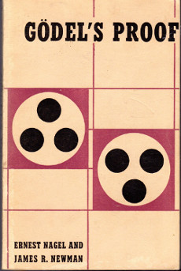
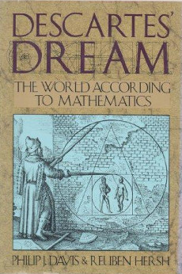
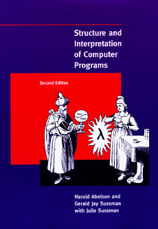

Foundation of Mathematics Reading List
------------------------------------

**04/13/2019**

A few years ago I took a philosophy of language class which
got me interested in the foundations of math and computer science.
Since then, has become one my my favorite subjects
and I have read about it aggresively for several years.

I wanted to organize the books I read into a list for others
who are interested in the topic.
Many good books were left out in favor of the very best.
They are arranged in a logical sequence
that will help prepare you for the next one.

### Logicomix

By: Apostolos Doxiadis

Logicomix is actually a comic book (or graphic novel as the kids say) that tells
an engaging story about the search for the foundations of math
and the beginning of analytic philosophy in the early 20th century. 

It will introduce you to all the major characters
such as Gödel, Russel, Frege, and Wittgenstein and 
motivate the kinds of problems they were trying to solve.
The book also explores how these ideas connect to modern computer science.

It is an absolute joy to read and will give you a taste
of whether this is an interesting subject for you.

### Gödel, Escher, Bach

By: Douglas Hofstadter

You probably have seen this work recommended before.
Hofstadter covers an enourmous range of topics
including formal systems, Godel's proof, theory of computation,
programming, molecular biology, and artifical intelligence.
In many ways it is an introduction to modern science.
It is written for a general audience and assumes no mathematical background.
Every topic is presented beautifully and with a lot of philsophical discussion.

### Gödel's Proof.

By: Newman & Nagel

Gödel, Escher, Bach does a good job of introducing the incompleteness theorem
and discussing its ramifications but there is still a lot left out which
you want to learn about it.

This short book offers another perspective and a clear explantion
of the mathematics of the proof, its general strategy, and the
historical context surrounding the incompleteness problem.

### Descartes Dream

By: Phillip Davis & Reuben Hersch

This book explores what it means to live in our mathematized world, that
fullfills a dream exprienced by Descartes.
It explores how mathematics and computer science work together,
surveys several intresting fields, and examines the ethical issue of the technological world.

If you like this book, the authors wrote another called *The Mathematical Experience*
which is aimed more at pure mathematics.

### Computation: Finite & Infinite

By: Marvin Minsky

Marvin Minsky is an incredibly clear and deep writer.
In this work he provides a mathematical framework
for thinking about mechanical machines and eventually the 
theory of computation.
Turing machines, finite state, and neural networks are explored in depth.
My project: [McCulloch & Pitts Neural Net Simulator](https://justinmeiners.github.io/neural-nets-sim/)
is based on this book.

This book does require some mathematical experience.
You should understand some logic and basic set theory
such as that taught in an introductory proofs course.

Unfortunatly, it is out of print
and may be difficult to obtain for a reasonable
amount of money. I read it from my university's library.
If that is not an option, I  I recommend you *find it online*.
If anyone knows of a place where I can reasonably purchase this book, let me know.

### Structure and Interpretation of Computer Programs

By: Gerald Sussman & Hal Abelson

[Read Online](https://mitpress.mit.edu/sites/default/files/sicp/full-text/book/book.html)

This classic book is designed to teach programming to MIT freshmen
who have some background in another area of math or science.
It is a hard read, but it assumes no programming knowledge and teaches Scheme (a lisp dialect) and
its full interworkings from the ground up.
Most of the material is mixed in the [excercises](https://github.com/justinmeiners/excercises/tree/master/sicp)
so don't skip them!

If you want to be a professional programmer,
this may be the only book you need to study.
What other book teaches you to write a symbolic differentiator, 
interpreter, circuit simulator, and compiler?

### Logical Foundations of Mathematics and Computation

By: Pavel Pudlak

This book covered almost all the concepts I learned about 
algebra and metamathematics in my entire undergraduate degree
in the first chapter.
This book is a massive and dense survey of important topics including
formal systems, set theory, abstract algebra, computability theory, 
analayis of algorithms, and quantum computing. 

Pudlak does a fantastic job of balancing technical
information with philisophical discussion.
I can't recommend this book enough.

This book assumes some mathematical maturity.
The author explains every concept that is introduced,
but it would be hard to read about a "group" for the first time
and really understand what is going on.
If you read through the other books, and have technical knowledge
you should be well prepared.

