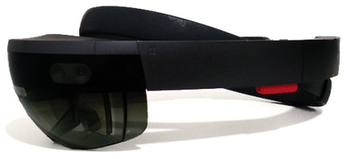

HoloLens First Impressions
--------------------------
**11/10/2016**

At work, I recently started on a new medical application for the [Microsoft HoloLens](https://www.microsoft.com/microsoft-hololens/en-us). I don’t follow popular technology news, and rarely get excited about new gadgets, but I feel that the HoloLens is a robust platform, with real substance beyond the usual VR gimmicks. In this article I will talk a little bit about my experience with the hardware and development environment, as well as outline some its shortcomings. As the current release is a "Developer Edition" I hope some of the items will be addressed in the consumer release.

Where the HoloLens succeeds most, is in offering an entirely distinct experience from VR headsets such as the Vive and Occulus. Everyone I have spoken to, who has tried both, immediately agrees the two are like apples and oranges. There is no question that the HTC Vive offers the most immersive graphical experience, but I get the feeling I could actually use the HoloLens for work, education, and other tasks beyond entertainment. The crisp display, is clear and readable, and since it doesn't overwhelm your vision it doesn't feel nauseating. The likelihood, of me setting up a full Vive room setup, to look at a piece of anatomy or the solar system is small, but quickly putting on the HoloLens to view a models from a true 3D perspective is helpful.

Microsoft recommends using Unity to get started with HoloLens development, while also providing native C++ and Direct 3D. Initially. using Unity didn’t excite me, but the it ends up working fairly well. Unity has a specific version of its engine adapted for HoloLens. This includes APIs and components for accessing the room scanning, world anchors, gestures, and voice controls. Once a build is exported from Unity, you can run, debug, and write code all in Visual Studio, until you need to modify the scene. The HoloLens can connect directly through USB or the WiFi for debugging. Microsoft has solid [documentation](https://developer.microsoft.com/en-us/windows/holographic/documentation) and tutorials to help you figure everything out.

The voice controls are excellent, and easy to develop for. While in my quiet office, I have never had it mistake me for simple commands such as "back" and "select". I'll even admit to working with food stuffed in my mouth, and it still recognized my commands about half the time. Speaking commands to yourself is still as embarrassing as it sounds (less so than shouting at your phone), but the technology is solid, and I believe there is potential here. Development for voice controls is a pleasant process as well. In Unity you can simply register phrases you would like to listen for, and receive callbacks when they are spoken.

The most noticeable limitation is the small field of view. Even though the glasses surround almost your whole vision, the displayable portion takes up only a small rectangular box at the front of your vision. This means that any objects larger than a basketball get chopped off while standing only a few feet away. This ugliness is most noticeable when a large model fills the whole viewing rectangle, leaving everything outside blank. It looks as if you are looking at the world through an open cereal box. Unfortunately, I can't show you what this looks like in a screenshot.

The gesture controls aren't terrible, but still feel clunky. It takes a little bit of time to master, and then it's sort of like having a mouse that fails to click every tenth time. They are made worse when other people are nearby to distract the sensor.

Since the entire system is contained within the headset, its GPU is more comparable to a mobile phone than a desktop machine. While not weak, the hardware feels a bit under powered. The frame rate cuts to about 30 frames, with roughly 50k triangles across 25 draw calls. I don't expect a ton here, but a bit faster would be nice. In my experience an iPad 2 has better GPU performance, but probably does a lot less background work. Given that I only tested in Unity, it is possible that using native C++ and Direct X would be a dramatic improvement. If you are using Unity be sure to use the optimized shaders found in [Microsoft's Holokit](https://github.com/Microsoft/HoloToolkit-Unity), and be conscious of batches.

The shortcomings above can hopefully be addressed in future iterations of the hardware. In its current form, it is still a fundamentally innovative platform and I am excited to continue developing for it.
