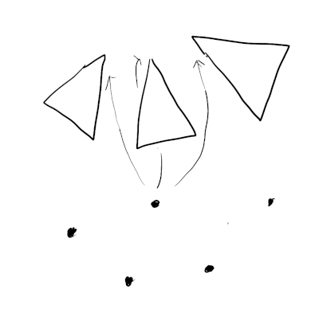

# A simple mesh adjacency data structure

**06/25/2022**

Considering a complex mesh data structure like [half edge][half-edge2] or [bmesh][bmesh]?
Here is a trick that may save you some energy. 
Face indices (which map faces to vertices) can be transformed into a **multi-map** which goes the reverse direction (mapping vertices to faces).
This can be used to perform adjacency traversals efficiently and is sufficient for many mesh processing problems.

[half-edge1]: https://fgiesen.wordpress.com/2012/02/21/half-edge-based-mesh-representations-theory/
[half-edge2]: https://kaba.hilvi.org/homepage/blog/halfedge/halfedge.htm
[bmesh]: https://wiki.blender.org/wiki/Source/Modeling/BMesh/Design

## Motivation

The standard way to store a 3D mesh is an  **indexed triangle mesh** 
which looks something like the following:

    vec3_t* vertices;
    uint32_t indices;

Each element of `indices` refers to an element in the `vertices` array,
and is the corner of a face.
For a triangle mesh, every 3 elements of `indices` constitutes a face.
The main advantage of this structure is it allows vertex information to be shared between faces,
given that faces are often conjoined.

The essential topology of the mesh is all here.
But it is not efficient to query.
Mesh processing usually involves traversing the mesh in a logical and local manner, including:

- finding the faces a vertex belongs to
- finding the neighboring faces for a given face.

To do this efficiently we need to add an **adjacency data structure** that stores local connections, such as the two examples mentioned previously.
As [Fabien describes][half-edge1], implementing these is challenging project.
There are a lot of invariants to keep track of.
It will probably be buggy the first time around.
Furthermore it often imposes restrictions on the kinds of meshes you can work with
(eg. closed manifolds, manifolds with boundary, etc).

Can we get away with anything simpler and easier?

## Inverting the index 

Given a face we can already lookup which vertices it contains.

What's missing is the ability to go the other direction,
finding the faces each vertex belongs to.

If we can achieve this, then all other queries become possible.
For example, to find neighboring faces of a face:

- lookup each vertex in the face
- for each vertex found, lookup each face it's a part of.

The challenge is a face has a fixed number of corners,
and each corner references exactly one vertex.
But a vertex can belong to any number of faces.
This suggests the need for a growing storage mechanism, or a linked structure,
which come with complexity or performance headaches.

Alternatively, consider the mesh `indices` as a function `g : F -> V`, mapping face (corner) indices to vertex indices. 
We are storing this function in it's Cartesian product form `g \subseq F x V` as a list of pairs!
Because `g` is not `1-1`, it's not an invertible.
But, we can still just flip it around to form a reverse relation `g' : V -> F`.
For each pair `(f, v)` just replace it with `(v, f)`.

## Implementing a reverse index

This new relation constitutes a **multi-map** which maps vertex indices to face corner indices.
Multi maps can be implemented efficiently as an array of sorted pairs `[(vertex, face)]`,
where each vertex and face can be appear as many times as needed.

    using ReverseIndex = std::pair<uint32_t, uint32_t>;
    ReverseIndex* reverse_indices = ...;
  
To look up the faces a vertex belongs to, simply binary search the array.
For example, to compute `degree`:

    struct reverse_index_less {
        bool operator()(const ReverseIndex& x, const ReverseIndex& y) {
            return x.first < rhs.y;
        }
    }

    int degree(uint32_t v0)
    {
         auto lookup = std::make_pair(v0, 0);
         auto range = std::equal_range(reverse_indicies, reverse_indicies + n, lookup, reverse_index_less());
         return (int)(range.second - range.first);
    }

Or to compute vertex normals from face normals:

    vec3_t average_normal(uint32_t v0, vec3_t* face_normals)
    {
         auto lookup = std::make_pair(v0, 0);
         auto i = std::lower_bound(reverse_indicies, reverse_indicies + n, lookup);

         vec3_t n;

         while (i != reverse_indices + n && i->first == v0) {
            uint32_t face_index = (i->second) / 3;
            n += face_normals[face_index];
            ++i;
         }

         return n.normalized();
    }

To construct the index you just need to sort. 

    ReverseIndex* reverse_indices = new ReverseIndex[index_count];

    for (int i = 0; i < index_count; ++i) {
        reverse_indices[i] = std::make_pair(indices[i], i);
    }

    std::sort(reverse_indices, reverse_indices + index_count);

## Analysis

It's easy to implement, but what are we missing?
Let's summarize some of it's limitations:

- It's a little cumbersome to write some operations.

- It doesn't help with edits like deletions and merges.
  A lot of these operations work well with half-edges
  which may be why you use.

  Suppose we want to delete a vertex.
  Removing elements from either the index or reverse index array is inefficient.
  It's probably best to mark them with a flag and clean them up later.

  If the faces in the index are marked deleted, then the entries in the 
  reverse index should be left.
  
- Looking up a face for a vertex is `O(log(n))` time.
  Note that this is still fast (16 steps for 64k elements),
  but not constant.

However, besides it's simplicity it has a few additional strengths:

- The additional reverse index add only 2x the memory of the index buffer.
  It is very convenient because it can be constructed alongside an indexed triangle mesh with no other modifications to the original data.

- Construction is very fast because sorting is fast.
  Creating a complex linked structure will almost certainly be slower,
  and require an intermediate hash map step.

- Works for all meshes and triangle soups. No restriction to manifolds.

 
