Old Artwork
--------------
**10/15/2015**

I am not much of a visual artist, but I still enjoy 3D modeling and animation. This page contains pictures of some of my older models I have worked on.

### Moon Rover

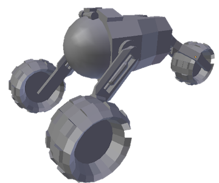 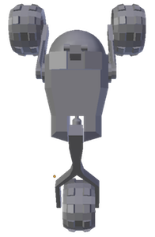

### Low-poly Cargo Ship

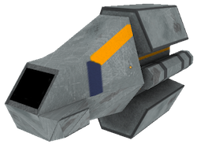 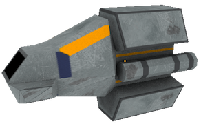

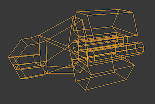 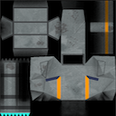

### Space Invader Sculpt

While working at Infuse Medical, I taught a course on 3D programming with OpenGL. As part of my course we created a small space invaders clone. Another developer created the low-poly model for the alien, which I use to create the high resolution sculpt shown below. Occlusion maps were generated from the sculpt for the game.

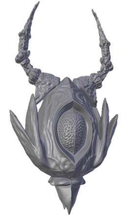 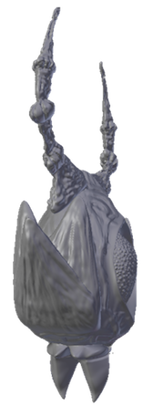

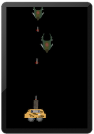 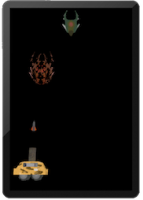

### Low-poly Radio

 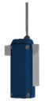 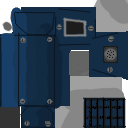

### Pixel Art

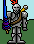
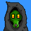

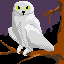

### Another Ship

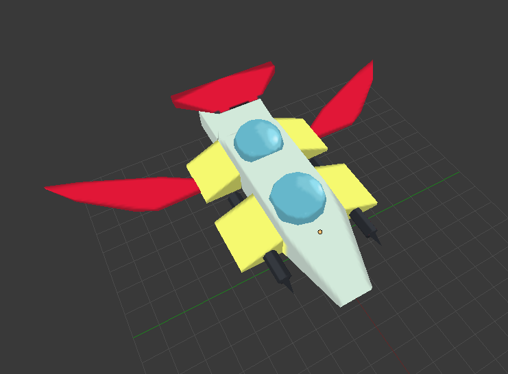

