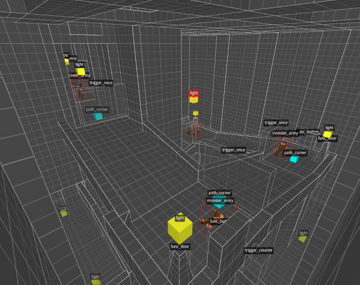
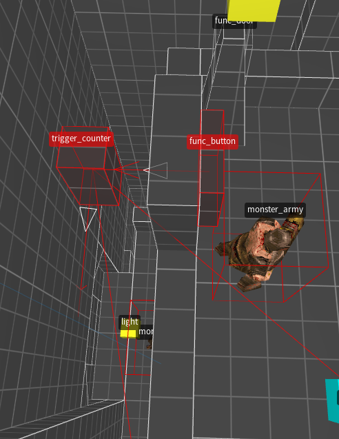

The Quake entity system: shell scripting for games.
===========================================

**By: Justin Meiners**

**07/20/2022**

The Quake engine has influenced an incredible number of games through direct licensing (games like Half-Life and Jedi Knights 2),
modders bringing its concepts to other studios, and competitors trying to best it (especially Unreal).
Most of what's been written about it focuses on the [3D graphics][abrash-graphics], or client/server [networking][quake-3-networking].
But, much overlooked is the innovative entity system which allows the game to simulate objects and level designers
to create interactive scenarios.

In this article I want to provide a brief overview of the Quake entity system and its design (for Quake generally, not just Quake 1).
Of particular interest to me is it's similarity to the UNIX philosophy.
Both designs can be summarized as having one primary substance (a unifying concept) and a language (the shell) for combining simple behaviors in emergent ways.

[source-engine]: https://developer.valvesoftware.com/wiki/SDK_Docs
[quake-3-networking]: https://fabiensanglard.net/quake3/network.php
[abrash-graphics]: https://www.bluesnews.com/abrash/contents.shtml

## Brushes

Before describing the entity system, there is an important technical concept to cover.
A *brush* is a 3D solid shape defined by a set of 3 or more 3D planes.
The solid is defined to be all the volume which is behind *all* of the 3D planes (also known as the intersection of half-spaces).
It's not hard to show that a fully enclosed brush must be a convex shape.

Brushes are useful for a few reasons:

- They are easy to edit and UV map, especially for making architecture-like features (a triangle mesh is more detailed, but also more work).
- They have nice mathematical properties. They are fully enclosed , We can compute collisions with them easily.
- They are convenient for computing BSP trees, which make rendering possible.

We think of brushes as a solid, but we can also convert a brush into a 3D triangle mesh for rendering.
One way to do this is to intersect the planes together, 3 at time, to create a vertex.
This requires solving a linear system.
Then for each plane the list of vertices lying in the plane can be assembled into a polygon.

## The categories

Quake divides the game world into a few simple categories.
At the top-level everything is either static or dynamic.
The static part mostly consists of scenery and the basic geometric area that makes up the levels.
The scenery is composed mostly of brushes.
The bulk of this is described by the singular `worldspawn` object in [`.map`][map-files] files, although some other `.map` entries are also static.

In an ideal world, nothing in the game would be static, so players would be free to interact with everything
(and it would make editing the level easier).
However, levels are static for performance reasons.
To render at real-time speeds, a bunch of data needs to be pre-computed, including BSP tree and lightmaps.
Generally, the scenery occupies most of the screen, so some of the pre-computing is a tradeoff favoring quality over interactivity.
For example, lightmapping/surface caching pre-computes higher quality lighting and shadows for the scenery.

Everything else in the world is dynamic.
All the dynamic things are called *entities*, and represent individual movable objects in the world.
The entities include characters, bullets, weapons, etc.

Entities are divided further into two kinds.
The first are *solid entities* which are represented by a union of brushes.
Their shape can be edited right in the level editor, so they can take on different forms as needed,
like a door, trigger, or platform.

The other kind are *point entities* and are represented by traditional triangle meshes.
While solid entities can be modified for each instance, point entities are much less flexible.
For example, the ammo pickups or characters have one standard model and always look the same.

All entities have spawn properties to configure their behaviour.
These are specified as key/value strings in the level editor,  and each kind of entity can choose which to read and how to interpret them.
For example, a property might specify which sound is played when the door is opened.

The [Quake 3][q3-properties] source explains properties well. Quake 1 is more convoluted as entities are written in `.qc` files.

[map-files]: https://quakewiki.org/wiki/Quake_Map_Format
[q3-properties]: https://github.com/id-Software/Quake-III-Arena/blob/dbe4ddb10315479fc00086f08e25d968b4b43c49/code/game/g_spawn.c#L99

## Everything is one thing.

It is not uncommon for games (then or now) to have complex object and behaviour hierarchies following object oriented or [component based][cowboy-components] design.
Quake rejects all that and ascribes to something like the UNIX mantra: "everything is a file".
In UNIX this means programs are files, data is files, network interfaces are files, even hardware devices are files.
When everything is the same you only need one interface to communicate.
Since most programs simply read and write data, treating the sources and destinations as a file works pretty well. 
Want to get input from a hardware device? Read from it like a file.
Everything becomes unified.

For the most part, it works well.
Sometimes the concept is pushed too far and very "special files" need to be treated carefully.

In Quake everything dynamic is an entity.
In fact, each entity is an instance of the same [big struct][entity-def]
containing a field for everything an object might need in the game.
Here is a small part, to give you an idea of what's included:

    typedef struct
    {
        float   modelindex;
        vec3_t  absmin;
        vec3_t  absmax;
        float   ltime;
        float   lastruntime;
        float   movetype;
        float   solid;
        vec3_t  origin;
        ...
        string_t    noise2;
        string_t    noise3;
    } entvars_t;

Obviously, each entity type does not utilize all the fields.
But, since gameplay tends to be the smallest part of the games workload, the wasted space is not a problem.
Entities just ignore what they don't use.

Quake's simple design provides similar unification benefits as UNIX.
The primitive operations, creating, destroying, communicating, are all the same.
Many entities need similar physics, and they can trivially share that functionality.
All the entities need to be networked, and this allows the networking algorithm 
to work the same for all of them, instead of synchronizing each type separately. 

The tradeoff is entities are not always well defined.
The only way to know what properties are available, and what they do, is to follow convention (or read the source code).

Perhaps the biggest advantage is it significantly reduces cognitive load for everyone, but especially designers.
When you have a complex set of categories, you have to think really hard about where every feature belongs.
You also spend a lot of energy refactoring components to accommodate new features.
Here you have no choice.
Figure out how to make it out of entity, or don't do it.
Functionality ends up being reused automatically.

This is might be a general rule.
If you can think of one primary element that unifies your software, you should probably use it.
The challenge is actually understanding your problem well enough to discover that unifying concept.

[entity-def]: https://github.com/id-Software/Quake/blob/master/QW/server/progdefs.h
[cowboy-components]: https://cowboyprogramming.com/2007/01/05/evolve-your-heirachy/

## Means of combination

UNIX acknowledges a basic fact about software: programming is expensive and takes a lot of time,
but at the same time computers still need to be able to perform many different tasks.
How can we minimize the amount of code that needs to be written, while maximizing usefulness?
UNIX addresses this by first cutting the list of needed programs down to an essential core.
Then it simplifies even further, by mandating that each program should only perform one simple task, such as extracting a line from a file.

On their own, these tiny programs don't seem terribly useful.
On Windows you would expect a lot more from a program than just being able to count characters in a file!
For UNIX, the power comes from the shell, which is an interactive terminal and language for orchestrating programs.
The shell provides operations, and means for combining the functionality of programs together.
Simple programs to be chained together in complex ways.
Suddenly a file downloader, an HTML converter, and a text editor, can be combined to make a web browser.
Programs are often useful in ways the original designer never anticipated.

The Quake Entity system takes the same approach.
Engineering is slow (especially for 3D games), but game and level designers need to be able to make a lot of content,
and iterate on their ideas quality.
They need to be able to open a door when the player presses a button, or trick the player, and spawn entities instead.
How can they do all of this, without resorting to programming?

Quake provides an event system which allows entities to send messages to each other.
Entities that send events have a `targetname` property which can refer to another entity.
Entities that receive events are then configured to respond.

Event producing entities include: 

- `func_button`:  A solid entity representing a button the player can press.
- `trigger_once`: A solid entity that triggers an event when the player intersects it.

Event receiving events include:

- `func_plat`: A solid entity representing a platform that can raise or lower. 
- `func_door`: A solid entity that moves over an opening.
- `light_flouro`: A point entity  that can be turned on and off.

An event system on it's own doesn't sound groundbreaking.
Every GUI builder let's you link button actions.
The interesting part is the role of the entity in this system.
Entities are not just game objects, they can also represent abstract concepts.
An invisible entity can be used as an intermediary between and input and output.
Here they can use logic to filter and redirect events.

You can think of these entities like electronic logic gates.
They allow the level designer to script together interesting scenarios and actions, from simple parts.
For example, in the image there is a `func_button` whose output is linked to a `trigger_counter`.
That `trigger_counter` also has an output linked to the door.
The counter counts down by a specified duration (in this case 3 seconds) and then fires, opening a door.

Abstract entities are also more than just pure functions.
It turns out abstract things often have state and modeling them as living in th world
can be helpful.

The fact that the abstract entities actually occupy space, provides an interesting advantage over text-based scripting languages.
The designer can associate the logic of the level with the elements that are controlled.
Placing a `trigger_counter` next to a button suggests the two work together.
Anyone who want to know how a piece of the level works, can just look at it, and see which entities to inspect.
Form follows function.

## Separation of concerns 

Consider how you might program a 3D button for a video game like Quake.
You might start with a 3D model of the button, then add an animation for when it is pressed.
Next you figure out how to read keyboard input to trigger the animation, and call a function when its triggered.
All of it works! 
But what if you want several button appearances?
You might provide some animation options, and some options to set the model, etc.
What if you sometimes want a sound to play?
The complexity grows with each feature.
 
The quake entity system recognizes that most of this functionality is orthogonal.
From a pure gameplay perspective, a button is just an area the player can provide keyboard input to
(most gameplay systems are much simpler than they appear).
Also, many different things need to play sounds and trigger animations.
Instead of combining this into one object, let's separate this into a sound playing entity, an animation entity, and a button input entity.
To create a button in the game, we can combine this network of gameplay entities,
and then can place it over any 3D model that represents the button.

This is classic separation of concerns, which is a hallmark of good software design.
It's a form of the [model view controller][mvc] pattern, but for games.
Besides further flexibility, it forces the designer to better organize and clearly understand what they actually want to accomplish.

Quake doesn't normally decompose things quite this far (partially due to limited tooling), but the principle
is used in other ways, and in other games.

## Progression

One measure of a good design is how well it ages over time.
It may work for the original task, but how does it address new demands and changing needs?
UNIX has of course evolved from the 60s into modern Linux, the backbone of the Internet,
and arguably where all the interesting OS work happens.
Linux still retains the original concepts and even many of the original programs.

We already know Quake engine is a part of many modern games.
A very successful example is Valve's [Source Engine][source-engine] which is a natural progression from Quake to modern technology, while still retaining its core concepts. 
In 2022, it's showing its age, but it has been working for a long time!
Almost all of the original quake entities are present in Source (`func_button`, `func_train`, etc).
These original entities  have been enhanced, a whole collection of new entities have been added 
(see a [full list][source-entities]).
But, largely the  Source engine looks a lot like the Quake engine, it just provides more detail
and systems. 

Here is an example which shows how sophisticated these entity systems have become.
In the image below is an interactive [keypad][keypad-prefab] made by a Source community member.
Here is their description of how it works:

>  It includes visual and audio responses to any 4-digit code. If the code is correct, it opens the door, plays an accepted sound, and blinks a green light. Otherwise, it plays a reject sound and blinks a red light.

As you can see, it's made up from a ton of entities.
Here are just a few:

1. `func_button`. One for each button on the keypad. 11 total.
2. `func_detail` the model of the keypad.
3. `prop_dynamic` the door model which opens.
4. `func_door` the logical entity that controls the doors motion.
5. `logic_case` stores the sequence of 4 expected numbers, and the events for successful code.
6. `logic_timer` resets the keypad entry after a period of inactivity.
7. 2x `ambient_generic`. Used to play the success or reject sounds.
8. ... 23 total entities!

This shows just how powerful the Quake entity system can be!

[keypad-prefab]: https://developer.valvesoftware.com/wiki/Keypad

[source-entities]: https://developer.valvesoftware.com/wiki/List_of_entities

[mvc]: https://en.wikipedia.org/wiki/Model%E2%80%93view%E2%80%93controller

