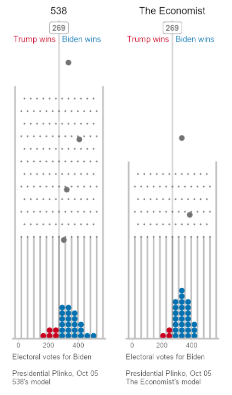
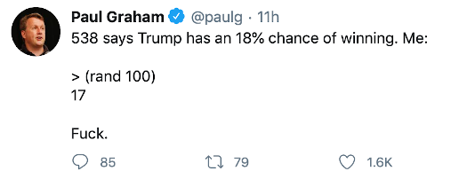
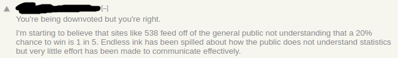
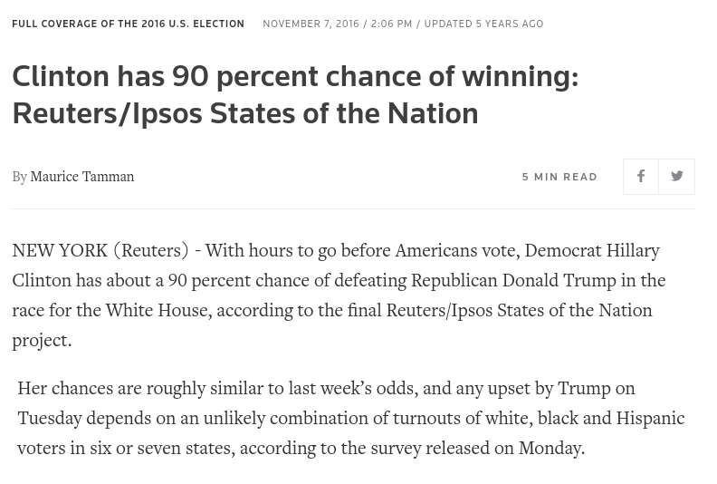

Questioning Probability
=======================

**10/8/20**

### Are Elections Actually Random?

A popular narrative explaining the outcome of the 2016 election is Hilary Clinton just got unlucky.
On election night, the odds were in her favor.
But when the dice were cast she unfortunately rolled snake eyes.
The comforting message implied by this interpretation explains it's popularity; 
it was nobody's fault, 
we still have the popular ideas,
we don't even have to change our strategy to win next time.
The alternatives are much harder to look at.
But, the behind this narrative is the underlying assumption
that elections are some kind of random event.
But, how similar is winning election to winning roulette?

Let's briefly relate what actually happens on voting day.
People wake up in the morning and decide to vote or not.
Those who choose to transport themselves to a voting location,
and then choose who's name to record, either by pushing a button or writing it in.
Later, the votes are tallied and grouped by region and a winner is announced.
Where is the randomness?
An individual might have an unexpected accident interrupting their plans 
but this is a tiny population and should be no different than
any other day. 
At each step of the process it's simple cause and effect.

It's even difficult to detect rapidly changing variables that might appear random.
The cultural and econcomic context have been slowly evolving over years.
The media environment has been carefully constructed over months leading up to it.
Each individuals broad political views are slow moving as 
they are a product of deeply rooted
influences, including family upbringing, income, ethnicity, religion, and education.

Hold on a minute.
Perhaps this is all a misunderstanding.
Journalists don't actually believe elections function like a lottery.
The percentages they throw around are simply confidence intervals related
to polling (See this [Pew Research article][pew-research]).
Pollsters can't talk to everyone in the country, so they talk to a
sample, and then use probability to guess how likely it is that
this sample represents the whole population.
It's basic statistics.

This may correctly describe where the numbers come from.
Perhaps in a back office somewhere, there is a Ph.D
in Statistics cooly measuring demographic models.
But this is clearly not how these figures
are presented by journalists and otherwise intelligent or
scientific people.
If it was, they  would be much more concerned with finding gaps
between the sample and population, than determining their odds in the bet.
Look at how randomness and chance is implied in the following popular media:

[pew-research]: https://www.pewresearch.org/fact-tank/2016/11/09/why-2016-election-polls-missed-their-mark/

**Election as a Pachinko Machine**

**Election as an Unlucky Dice Roll**

**20% is still 1 in 5**

**The unlikely combination**

### Our Cultural of Randomness

Explanations which defer to randomness aren't confined to politics.
Culturally, we have an underlying trust in the power of probability.
This is perhaps driven by similar motivations as the election; avoiding assigning blame
and considering difficult alternatives.
Nobody knows what businesses will be succesful, just try a bunch of them.
Don't plan too far into the future, it's going to be a different world.
Smart people use data to make decisions and overcomes biases.
Didn't you watch Money Ball?

At a first glance, our love for randomness seems
to be an extension of our love of science, logic, and intelligence.
Just look at all the numbers, equations, and graphs!
But, more fundamentally, it comes from our beliefs about the physical world; 
the world is made up of atoms crashing into each other in the void,
and at the atomic level quantum events are happening which we don't understand.
Fundamentally, the  future is indefinite, uncertain, and hazy.
We can't really plan or predict it.
Sometimes we can setup Fleming or Darwinian-like projects to tip chance
in our favor,
but the best thing to do is leave all your options open to respond to unforeseen conditions.
(See "Zero to One" for an exploration of these ideas.)

But just like with elections, randomness as in everyday life seems a lot less
convincing after asking a few basic questions.
How many things in our world are actually random?
Science and engineering are predicated on the idea that 
the world behaves predictiably and is driven by cause and effect.
Even if, the underlying quantum mechanics are best described
with probabilistic models, 
every event at the human scale can
be accurately described using deterministic Newtonian relationships.

In computer programs it's not even possible to obtain data which is truly random.
Usually it's just a [function][5] which is hard to predict, and uses varying
inputs like time of data.
Better sources sample from physical motion, like air vibrations.

### When is Probability Useful?

That is not to suggest that the entire field is misguided.
Probability itself is a sound mathematical model, central
to scientific inquiry.
But, if the required axiom of having a random variable
is virtually always false, then why should we ever hope to apply it 
in the real world?

We have already talked about one use case.
Reasoning about a population from a sample.
Ignoring the missing principle of uniformity in nature, and whether
distributions are correct, this is still a helpful way to study 
large groups.

Another use case is when there are just too many variables to understand.
When we have a cause and effect theory, but too many input variables,
it's overwhelming to use, so we settle for partial information.
Consider a dice roll.
Through classical mechanics we can understand gravity, the force of the throw, the friction in the air,
the impact on the table, 
and with all this make an accurate description of the outcome.
But no human can capture all those parameters in a split second and apply them.
Without a controlled environment for study probability is a good model.

However, statistical physical models don't just making random assignments.
They tightly constrain the probability with deterministic mathematics,
such as using regular formulas for area and force. (3)
Furthermore, they never imply an underlying law of randomness.
Rather they are useful compromises with tolerable inaccuracies.

The most common use case for statistics,
and the one that needs to be scrutinized the most, 
is when you don't really
understand cause and effect relationships.
Without a workable theory of nature, stats act as an adhoc placeholder.
Data gets mapped to distributions, and patterns get correlated,
without considering how the underlying objects works.

When this is your only option, it's probably better than nothing.
But, you have to be honest about the limitations. 
You definitely shouldn't be surprised to find "black swans"
when all you did is plot a bell curve,
and hope everything else follows uniformly.

Consider two fields almost synonymous with stats; economics and psychology.
Does anyone have a clear picture of how markets function,
or the causes of inflation?
Can anyone give an account of why people think and believe what they do?
Of course not, and the popular theories change rapidly and dramatically.
There are are a lot of variables in these domains
too, so perhaps probability models are unavoidable.
But clearly they are lacking in explanatory theories.
Maybe a scientific theory isn't even possible.

### A Universal Way of Understanding

In [The Republic X][4], Plato observes a related attitude in painting and poetry. 
He describes their practice as giving an appearance of understanding through shallow, and quickly made presentations:

> The imitator, I said, is a long way off the truth, and can do all things because he lightly touches on a small part of them, and that part an image.
> For example: A painter will paint a cobbler, carpenter, or any other artist, though he knows nothing of their arts; and, if he is a good artist, he may deceive children or simple persons, when he shows them his picture of a carpenter from a distance, and they will fancy that they are looking at a real carpenter. 

>  And whenever any one informs us that he has found a man knows all the arts, and all things else that anybody knows [...] I think that we can only imagine to be a simple creature who is likely to have been deceived by some wizard or actor whom he met, and whom he thought all-knowing, because he himself was unable to analyze the nature of knowledge and ignorance and imitation. 

> And so, when we hear persons saying that the tragedians, and Homer, who is at their head, know all the arts and all things human, virtue as well as vice, and divine things too, for that the good poet cannot compose well unless he knows his subject, and that he who has not this knowledge can never be a poet, we ought to consider whether here also there may not be a similar illusion. Perhaps they may have come across imitators and been deceived by them

Statistics students and professionals hold the same remarkable belief about their own field today.
They don't need to study any subject or "applications", besides statistics itself.
Their statistical knowledge is immediately transferable to
understanding any problem thrown their way, whether in tech, business, politics, finance, or healthcare.
It's a universal framework for understanding.
This makes it the perfect career in the culture of randomness, and ironically
minimize the need to make predictions about the future.

But can you understand business without running one?
Can you understand voting patterns without understanding what
is happening in people's lives?
Can you understand psychology without thinking, observing, and talking to people?
Lack of basic knowledge and experience leave a lot to be desired.
In these areas, as in politics, we can conclude that probability and statistics are poor substitutes
for explanatory theory.

**Notes**

(3) For a specific examples see the derivations for the equations of [motion of gasses][3]
or how probability is used to [estimating integrals][2].

[2]: https://en.wikipedia.org/wiki/Monte_Carlo_method
[3]: https://en.wikipedia.org/wiki/Kinetic_theory_of_gases
[4]: http://classics.mit.edu/Plato/republic.11.x.html
[5]: https://en.wikipedia.org/wiki/Pseudorandom_number_generator
