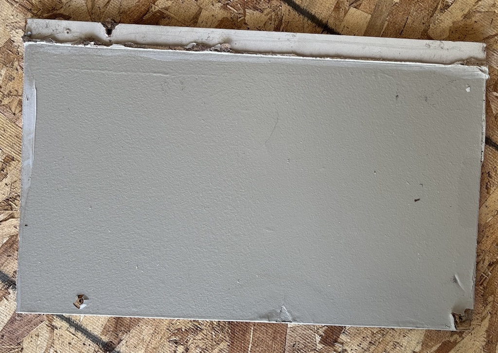
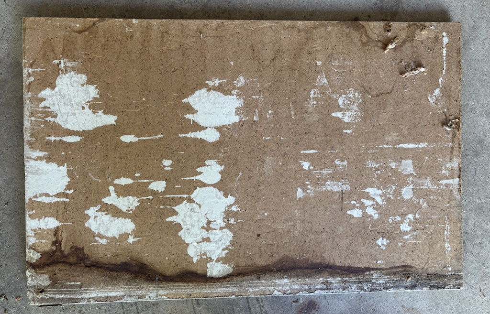
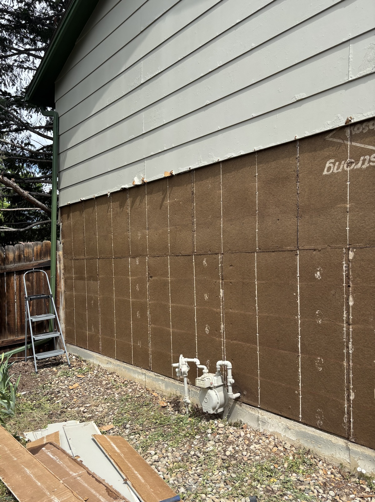

Replacing HardBoard Siding
==========================
**06/21/2025**

This summer I replaced part of the siding on my 1970s house in Boulder.
The project turned out great, better than I hoped!

While planning, I had a hard time finding good information about the techniques and materials
used for this style of home.
This [video](https://youtube.com/watch?v=Ne-lAjU0MZI) gave me confidence that I could do it,
but lacked a lot of detail, especially in regards to possible replacement materials.
So I wanted to share what I learned in the project, in case it can help anyone else. 

**Disclaimer:** I am an occasional DIY'er not a construction professional.

## Siding materials

The original siding on the house is a wood composite material 
 referred to as hardboard, or by the brand name "Masonite".
It's basically glorified cardboard,
and has long been defunct as it doesn't hold up well to moisture.
Very dry climates like Colorado may be the only places where it's still surviving.

Here you can see some moderate bubbling indicating moisture damage:

About half of my house was actually in good shape.
But the parts that are heavily exposed to sun and rain were in disrepair.

The original board is 12" wide and 7/16" thick.

Notice the water damage on the edge:
 

I was unable to find anyone who supplies the original hardboard, so I had to substitute.
I chose LP Smartside smooth finish, which is 12" wide and 3/8" thick.
This is a much higher quality material made from OSB, but has similar dimensions and appearance.
The manufacturer also provided recommendations for install and materials like nails, which were helpful to refer to.

## Removing old boards

The previous stuff was face nailed so it's pretty easy to get underneath with a pry bar.
After a little effort, the nail typically separates from the siding, making it easy to pull out with a hammer. Since it's being removed, you can be pretty rough with every board except the last.

You'll notice that my sheathing is not modern OSB but instead fiberboard, another defunct product.

I don't know too much about it.
Part of my motivation for the project was to determine if any places needed to be replaced.
I was pleasantly surprised to find it in good condition and didn't need to touch it.

You'll notice that there is no vapor barrier/house wrap on the outside.
This is more common for older homes, but my research also indicated it's more acceptable for fiberboard constructions.

## Assembly

The house is 24 ft wide, so a single row requires a 16ft and 8ft board.
The long and short side alternate with each row to protect and hide seams.

One piece of siding was ripped into 2" strips for the base.
This is installed below the bottom row along the foundation.
The first row of siding then rests upon this.

Once the first row is done, it gets much easier.
You just lay the next board above at the proper height and nail it in.
I chose to pre-drill holes in the siding to prevent splitting on the thin side.

We did hammer the whole thing by hand.
I considered purchasing a pneumatic nailer,
but they are really only available at professional price points.
Note that siding requires a special kind of nailer 
as the nails are different than the ones you can use with a framing or roofing nailer.
It's worth it if you do the whole house.

## Painting

The boards come primed on the outside side.
So it's ready to paint with 2 coats.
Large rollers worked well for these large boards. 
The color match turned out great and look just like the old boards!

The new seams and edges must be caulked before painting.
I also took time to cleanup up the old boards and seams were not replaced.

All done! Thanks to my family members for all their help.
