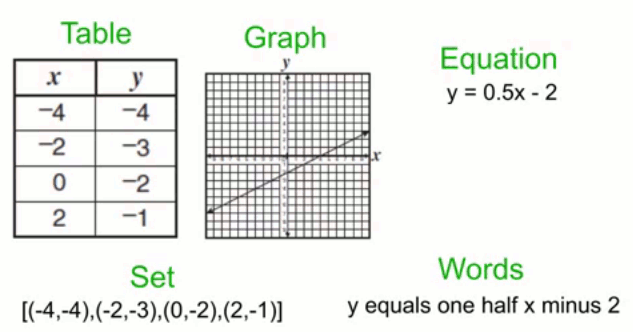
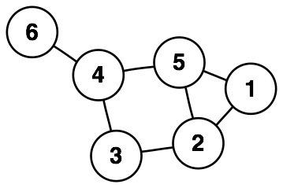
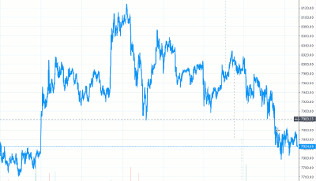

Think in Math. Write in Code.
-----------------------------
**6/8/19**

Programmers love to discuss programming languages.
We not only debate their technical merits and aesthetic qualities,
but they become integrated into our personal identities,
along with the values and traits that we associate with them.
Some even defend a form of [Linguistic Determinism][6] that thinking is confined to what the language 
makes typable.

Since we spend so much time writing code, a keen interest in language design is justified.
However, the character of these discussions suggests that we think of them as much more, 
and have perhaps forgotten their primary role.
Programming languages are *implementation tools* for instructing machines, not *thinking tools* 
for expressing ideas.
They are strict formal systems riddled with design compromises and practical limitations.
At the end of the day, we hope they make controlling computers bearable for humans.
In contrast, thoughts are best expressed through a medium which is free and flexible.

## Thinking in Math

The natural language which has been effectively used for thinking about computation, for thousands of years, is mathematics.
Most people don't think of math as free or flexible.
They think of scary symbols and memorizing steps to regurgitate on tests.
Others hear math and think category theory, lambda calculus, or other 
methods of formalizing computation itself, but these are hardly
necessary for programming itself.

I hope readers of this article have had a better experience regarding what math is about, such as a graph theory, algorithms, or linear algebra course;
the kind that involves logic and theorems, and is written in prose with a mix of symbols (most symbols weren't even invented until the [16th century][7]).
This kind of math is about creating logical models to understand real world problems, through careful
definitions and deductions.
If you don't have a clear idea of what this looks like I recommend [Trudeau][1],
[Stepanov][4], or [Manber][3].

Math allows you to reason about logical structures, free from other constraints.
This is also what programming requires: creating logical systems to solve problems.
Take a look at the basic pattern for programming:

1. Identify a problem
2. Design algorithms and data structures to solve it
3. Implement and test them

In practice, work is not so well organized as there is interplay between steps.
You may write code to inform the design.
Even so, the basic pattern is followed over and over.

Notice that steps 1 and 2 are the ones that take most of our time, ability, and effort.
At the same time, these steps don't lend themselves to programming languages.
That doesn't stop programmers from attempting to solve them in their editor, but they end up with code that is muddled, slow, or that solves the wrong problem.
It's not that programming languages aren't good enough yet.
It's that *no formal language* could be good at it.
Our brains just don't think that way.
When problems get hard, we draw diagrams and discuss them with collaborators.

Ideally, steps 1 and 2 are solved first, and only then will a programming language be used to solve step 3.
This has an added benefit of transforming the implementation process.
With a mathematical solution in hand, you can then focus on choosing the best representation and implementation, and writing better code, knowing what the end goal will be.

## Implementation Concerns

Why are programming languages burdensome thinking tools?
One reason is that writing code is inseparably connected with implementation concerns.
A computer is a device that must manage all kinds of tasks and while being bound by physical
and economic constraints.
Think about all the considerations for writing a simple function:

- What inputs should I provide?
- What should they be named?
- What types should they be? (Even dynamically typed languages must consider types, it's just implicit.)
- Should I pass them by value or by reference?
- What file should I put the function in?
- Should the result be reused, or is it fast enough to recalculate it every time?

The list can go on. The point is that these considerations have nothing to do with what the function does.
They distract from the problem the function is trying to solve.

Many languages aim to hide details such as these, which is helpful, especially for mundane tasks.
However, they cannot transcend their role as an implementation tool.
SQL is one of the most successful examples of this, but it is ultimately concerned with implementation concerns such as tables, rows, indices, and types.
Because of this, programmers still design complicated queries in informal terms, like what they want to "get," before writing a bunch of `JOIN`s.

## Inflexible Abstractions

Another limitation of programming languages is that they are poor abstraction tools.
Typically, when we discuss abstraction in engineering, we mean hiding implementation details.
A complex operation or process is packaged into a "black box" with its contents hidden and well-defined inputs and outputs exposed.
Accompanying the box is fictional story that explains what it does, in a greatly simplified way.

Black boxes are essential for engineering large systems since the details are too overwhelming to hold in your head.
They also have many well-known limitations.
A black box [leaks][5] because its brief description cannot completely determine its behavior.
The opaque interfaces introduce [inefficiencies][8], like duplication and fragmented design.

Most importantly for problem-solving, black boxes are rigid. 
They must explicitly reveal some dials and knobs, and hide others,
commiting to a particular view about what it is essential to expose to the user,
and what is noise.
In doing so, they present a fixed level of abstraction which may be too high-level or too low-level for the problem,
As an example, a high-level web server may provide a terrific interface for serving JSON, but be useless if one wants an interface for serving incomplete data streams, such as output from a program.
In theory, you can always look inside the box, but in code, the abstraction level at any one time is fixed.

In contrast, the word abstraction in math is nothing like hiding information.
Here, abstraction means extracting the essential features or characteristics of something, in relation to a particular context.
Unlike black boxes, no information is hidden.
They don't leak in the same way.
You are encouraged to adjust to the right level of abstraction and quickly jump between perspectives.
You might ask:

- Is this problem best represented as a table? Or, a function?
- Can I look at the whole system as a function?
- Can I treat this collection of things as a single unit?
- Should I look at the whole system or a single part?
- What assumptions should I make? Should I make them stronger or weaker?

Just look at the many ways of looking at a function:

[][10]

Thinking in math allows one to use whichever brings the most clarity at any moment.
It turns out most abstract concepts like functions can be understood from many perspectives.
Studying math expands ones toolbox of perspectives and abstractions.
Simple concepts like logarithms and exponentials help us understand rates of growth in algorithms.
You might analyze the [geometric][9] considerations of network traffic,
or realize that your data structure operates as a group, and gain insights from abstract algebra.

To summarize, programming languages are great engineering tools for assembling black boxes;
they provide functions, classes, and modules, all of which help wrap up code into nice interfaces.
However, when trying to solve problems and design solutions, what you actually want is the math kind of abstraction.
If you try to think at the keyboard, the black boxes available to you will warp your view.

## Problem Representation

Just as programming languages are rigid in their ability to abstract, they also are rigid in how they represent data.
The very act of implementing an algorithm or data structure is picking *just one* of the many possible ways to represen
something; along with all the tradeoffs that come with it.
It is always easier to make tradeoffs when one has use cases in mind and understand the problem well.

For example, graphs (sets of vertices and edges) appear in many programming problems such as internet networks, pathfinding, and social networks.
Despite their simple definition, choosing how to represent them is hard and varys greatly depending on use case:

- The one which most closely matches the definition:  
  `vertices: vector<NodeData> edges: vector<pair<Int, Int>>`
  (The vertices can be removed if you only care about connectivity.)

- If you want to traverse a node's neighbors quickly, then you probably want a node structure:  
  `Node { id: Int, neighbors: vector<Node*> }`

- You could use an [adjacency matrix][11]. Where each row stores the neighbors of a particular node: 
  `connectivity: vector<vector<int>>` and the nodes themselves are implicit.

- Pathfinding algorithms often work on graphs implicitly from a board of cells:  
  `walls: vector<vector<bool>>`.

- In a peer-to-peer network, each computer is a vertex and each socket is an edge.
  The entire graph isn't even accessible from one machine! 

Math allows you to reason about the graph itself, solve the problem, and then choose an appropriate representation.
If you think in a programming language, you cannot delay this decision as your first line of code commits to a particular representation.

Note that the graph representations are too diverse to wrapped up in a polymorphic interface.
(Consider again the graph representing a computer network, like the entire internet.)
So creating a completely reusable library is impractical.
It can only work on a few types, or force all graphs into an inappropriate representation.
That doesn't mean libraries or interfaces aren't useful.
Similar representations are needed again and again (like `std::vector`),
but you cannot write a library which encapsulates the concept of "graph" once and for all.
A simple generic or interface with a few types in mind is appropriate.

As a corollary, programming languages should focus primarily on being useful implementation tools,
rather than theoretical tools.
A good example of modern language feature which does this is async/await.
It's not hiding away complex details or introducing new conceptual theory.
It takes a common practical problem and makes it easier to write.

Thinking in math also makes the "C style" of programming more appealing.
When you understand a problem well, you don't have to build up layers of framework and abstraction
in anticipation of "what if".
You can write a program tailor made to the problem, with carefully chosen tradeoffs.

## Example Project

So what does thinking in math look like?
For this section you may have to read a bit more slowly and carefully.
Recently, I worked on an API at work for pricing cryptocurrency for merchants.
It takes into account recent price changes and recommends that merchants charge a higher price during volatile times.

Although we did some homework on the theory, we wanted to empirically test it to see how it performed during various market conditions.
To do so, I designed a bot to simulate a merchant doing business with our API, to see how it performs.

**BTC/USD (1 day)**

### Preliminaries

**Definition:** The **exchange rate** `r(t)` is the market rate of `fiat/crypto`.

**Definition:** The **merchant rate** `r'(t)` is the modified exchange rate which the merchant is advised to charge customers.

**Definition:** When a customer buys an item, we call that event a **purchase**.
A purchase consists of the price in fiat and a time. `p = (f, t)`.

**Theorem:** The amount of crypto for a purchase is found by applying the modified exchange rate
`t(p) = p(1) / r'(p(2))`.

**Proof:** `p(1) / r'(p(2)) = fiat / (fiat/crypto) = fiat * crypto/fiat = crypto`

**Definition:** When the merchant sells their crypto holdings, we call that event a **sale**.
A sale consists of an amount in crypto and a timestamp. `s = (c, t)`.

**Theorem:** The amount of fiat the merchant obtained from a sale is found by applying the exchange rate to the sale `g(s) = s(1) * r(s(2))`.

**Proof:** `s(1) * r(s(2)) = crypto * (fiat/crypto) = fiat`

**Definition:** The **balance** of a set of purchases and sales is the difference between all purchase crypto amounts and all sale crypto amounts.
 `b(P, S) = sum from i to N of t(p_i) - sum from j to M of s_j(1)`

Note that `b(P, S) >= 0` must always hold.

**Definition:** The **earnings** of a set of purchases and sales is the difference between sale fiat amounts and purchase fiat amounts.
`e(P, S) = sum from j to M of g(s_j(1)) - sum from i to N of p_i(1) >= 0`.

### Objective

**Definition:** We say that the merchant rate is **favorable** iff the earnings are non-negative for *most* sets of *typical* purchases and sales.
`r'(t) is favorable iff e(P, S) >= 0 `.

In a favorable case, the merchant didn't lose any fiat by accepting crypto.

*most* and *typical* will not be rigorously defined.

As part of *typical*, we can assume that merchants will sell their crypto in a timely manner.
So assume `s_i(2) - s_j(2) < W` for `i,j in {1.. M}` for some bound `W`.
Purchase amounts should be randomly distributed within a reasonable range that commerce is done. Perhaps $10-100.

**The goal of the bot is to verify that `r'(t)` is favorable.**

Note that this definition is only one measure of quality.
Perhaps protecting against the worst case is more important than being favorable.
In that case, we would be concerned about the ability to construct a set of purchases with very negative earnings.

### Algorithm

Repeat many times:

 1. Randomly choose a time range `[t0, t1]`.
 2. Generate a set of **purchases** at random times within `[t0, t1]`.
    The price should fall within a range `[p0, p1`] of *typical* prices.

 3. Generate a set of **sales** at evenly spaced times (perhaps with slight random noise) within `[t0, t1]`.
    Each sale should be for the full **balance** at that time.
 4. Calculate the **earnings** for these sets.
 5. Record the earnings.

After:

 1. Report how many earnings were negative and non-negative. Show a percentage for each.
 2. Identify the minimum and maximum earnings and report them.

### Conclusion

As you read this example, I think your tendency may be to think that its statements are obvious.
Certainly, none of these steps are hard.
However, it was surprising to me how many of my assumptions were corrected and how difficult it was to choose an objective definition of a **favorable** outcome.
This process helped me become aware of assumptions I would not have even considered if I had started by simply writing code.
Perhaps the greatest benefit was that after writing it, I was able to quickly review it with a co-worker and make corrections which were easy on paper, but would have been difficult to change in code.

I hope that thinking in the language of math will bring similar benefits to your projects!
Note that this example is only one style of utilizing mathematical thinking.

[1]: https://www.amazon.com/Introduction-Graph-Theory-Dover-Mathematics/dp/0486678709
[3]: https://www.amazon.com/Introduction-Algorithms-Creative-Udi-Manber/dp/0201120372
[4]: https://www.fm2gp.com
[5]: https://www.joelonsoftware.com/2002/11/11/the-law-of-leaky-abstractions/
[6]: https://en.wikipedia.org/wiki/Linguistic_determinism
[7]: https://en.wikipedia.org/wiki/History_of_mathematical_notation#Symbolic_stage
[8]: https://www.youtube.com/watch?v=lHLpKzUxjGk
[9]: https://en.wikipedia.org/wiki/Felix_Klein#Erlangen_program
[10]: https://www.youtube.com/watch?v=ACZDnF8-9Ks
[11]: https://en.wikipedia.org/wiki/Adjacency_matrix
