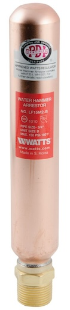
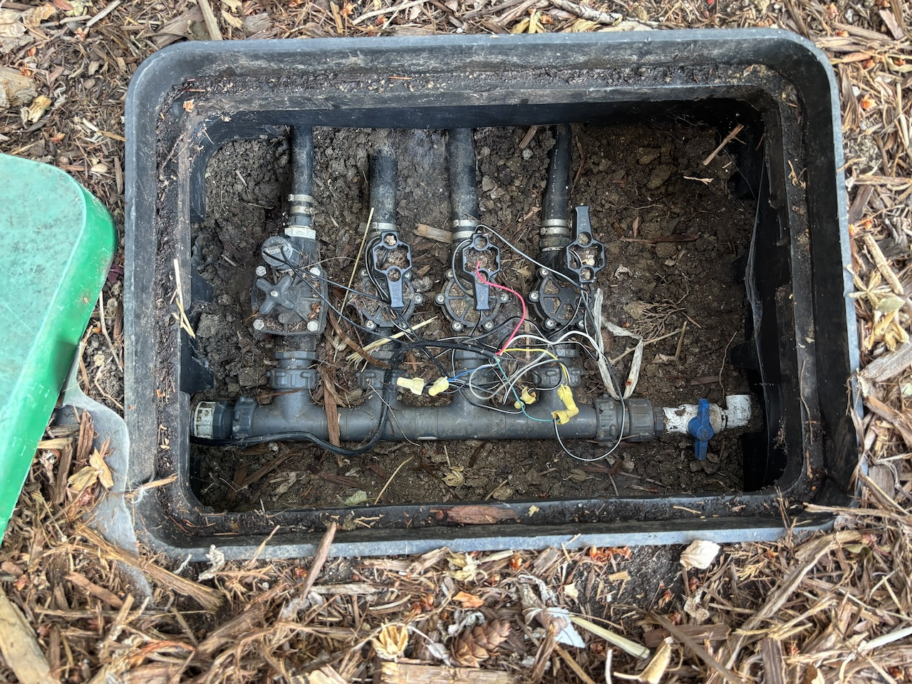
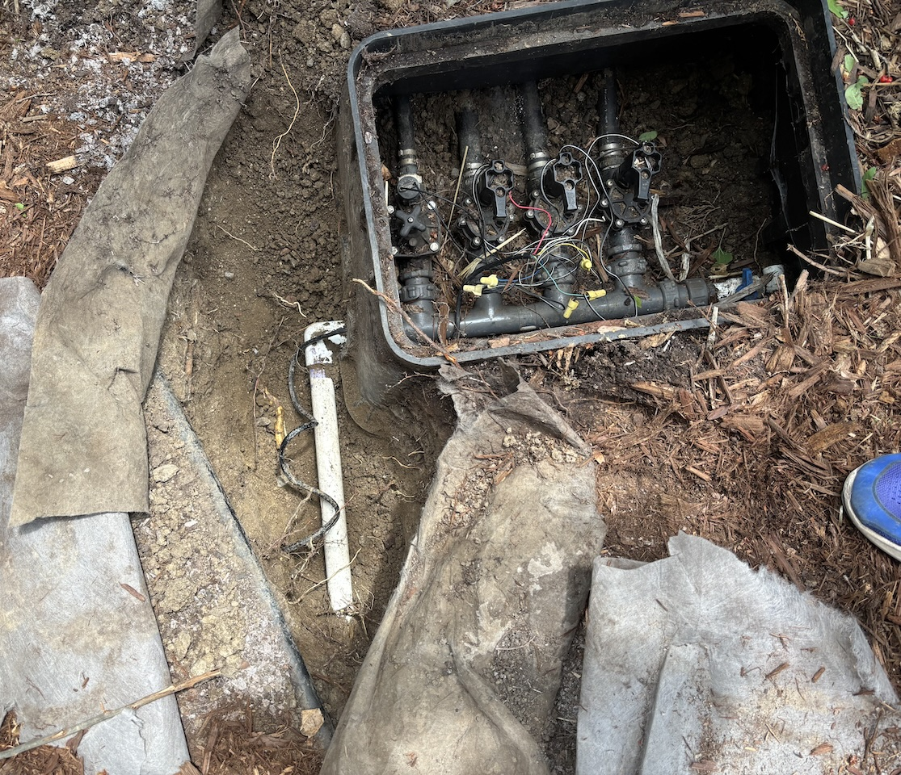
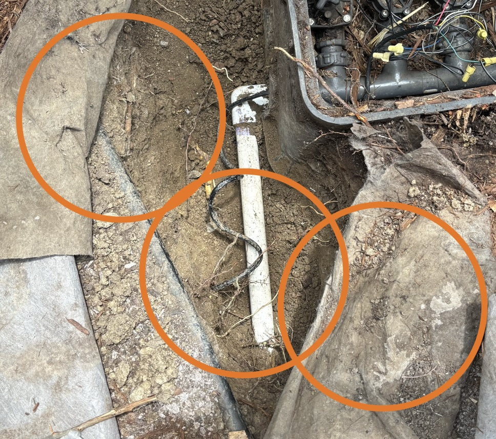
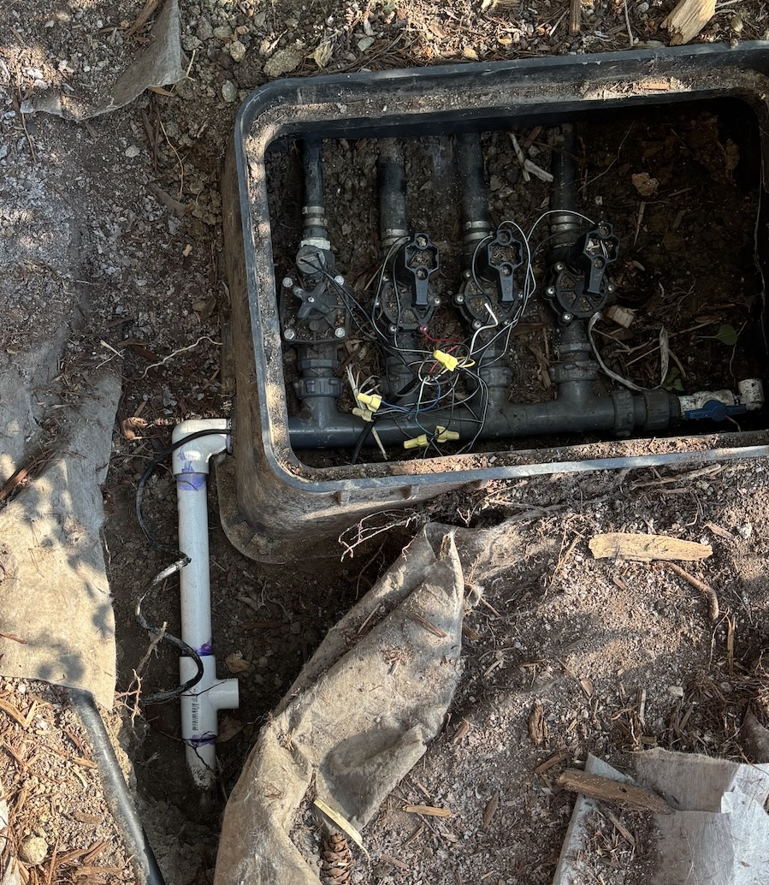
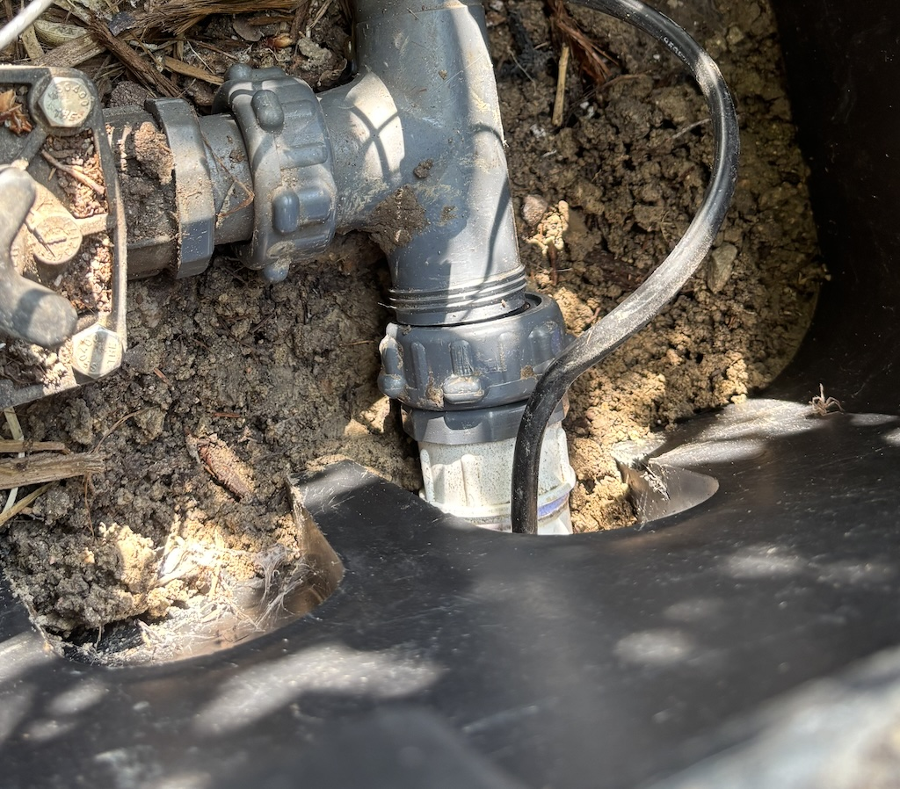
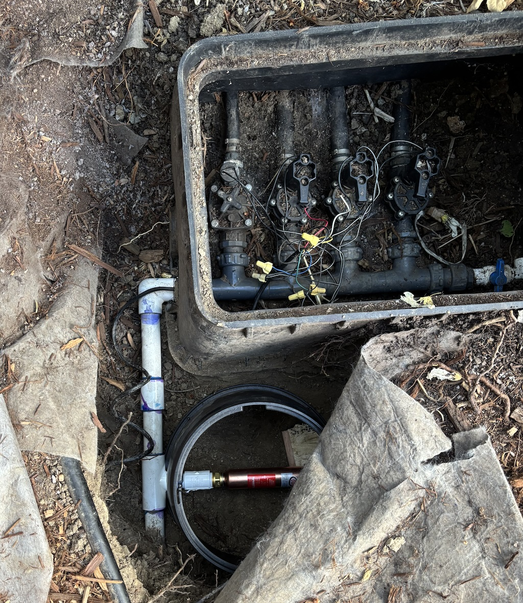
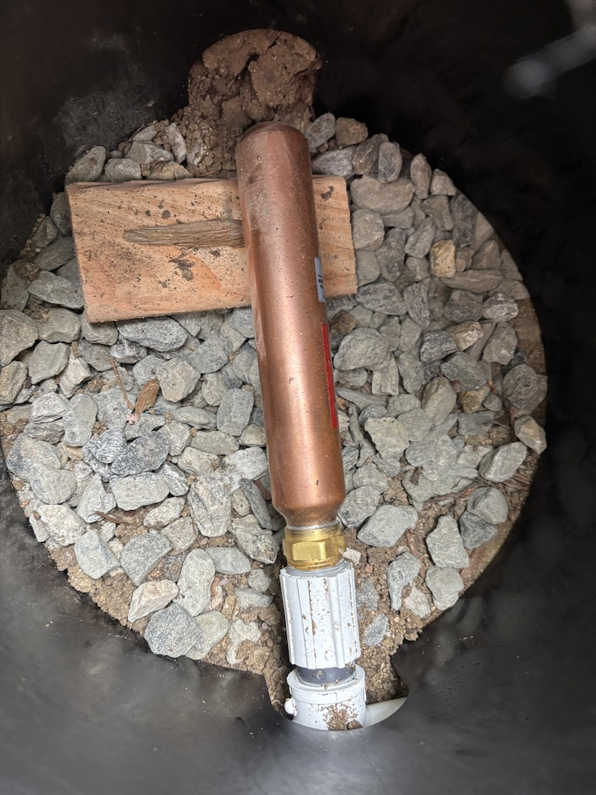
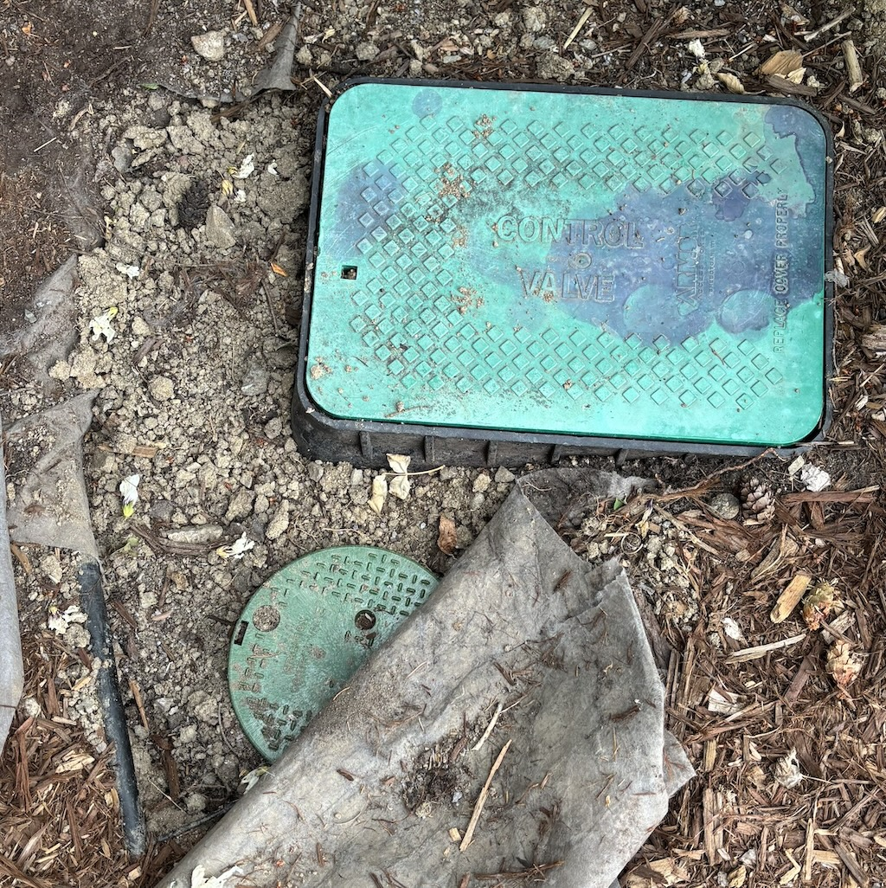

Water Hammer Arrestor
=====================

**08/02/25**

I'm back with another house maintenance project (and not talking about computer technology).

My irrigation system has been making awful water hammer noises.
It's so bad, that I haven't felt comfortable watering my lawn, due to fear of damaging the plumbing.
Here are the symptoms of my problem:

1. Only occurs when a valve opens, not when it closes. (fast moving water slamming into a valve is a common problem).
2. Occurs regardless of how long the sprinkler has been on. I can close a valve, and reopen it 10 seconds later and it's the same.
3. Severity varies across different zones. Zones closer to the manifold seem worse.

These rule out most of the quick water hammer fixes,
for example adding a delay between zone activation doesn't help.
So I determined the best solution was to install a water hammer arrestor.
Here is how that went.

**Disclaimer:** I am an occasional DIYer not a professional plumber. My intent is to share my exprience with the hope that it might be helpful for you.

## Plan

I want to insert the arrestor as close as possible to the manifold,
so it provides benefit for all zones, and protects as much of the plumbing as possible.
Unfortunately, the sprinkler box is out of space, so I needed to dig up and insert on to the incoming line. 

I also want make enough space for a new box to house the arrestor, so I can access it later.

There are quite a few positions and orientations to consider.
Vertical orientation seems natural, but the arrestor is actually too long, and so I chose to lay it horizontally (OK for this model).
I could replace the elbow with a tee to get shock absorption at the corner, but I don't want to rebuild the manifold connection.

## Attempt 1

So I cut the pipe, attached the tee, and put it all together.
The elbow with the threaded manifold connection gives me an advantage.
I can connect this piece last and avoid the challenge of connecting two pieces of PVC.
(This is classic plumbing problem where there is insufficient space to slide a coupling on to both sides.). 

My expectation was that the threaded piece would haves some give and allow me to easily connect back to the manifold.
But that was not the case.
With everything assembled, the pipe and the manifold were offset from each other by about 1/8",
and there was absolutely no give.

I was completely out of luck.
Not anticipating this problem was an *amateur* mistake.

## Attempt 2

I needed to try again.
I researched alternative ways to join the pipe (and avoid the same problem), but none looked better than my initial idea.

So I cut the tee and redid it all.
This time I was extra careful, and measured everything with the elbow piece attached to the manifold.
On the final assembly step, I connected the elbow and threaded it to the manifold with the cement wet.
This was tricky because I had about 5 seconds to insert the piece, rotate it into position through the box,
and get the threads aligned.
One trick that helped was inserting a piece of plastic underneath the connection to keep them out of the mud.

It all worked out!

## Arrestor assembly

Although not strictly necessary, I attached a PVC 40 nipple rather than threading the arrestor directly into the tee.
Brass into PVC connections are less reliable, and I want to protect the tee's threads if I need to replace in the future.

I filled the arrestor box with gravel and cut a block for the weight to rest on.

## Results

I was pleasantly surprised with how well this little part works.
3 of my zones are completely quiet, and 1 has small bump when it starts.

(Yes, I spilled PVC primer all over my lid.)

Thanks to ChatGPT for all the plumbing advice!
